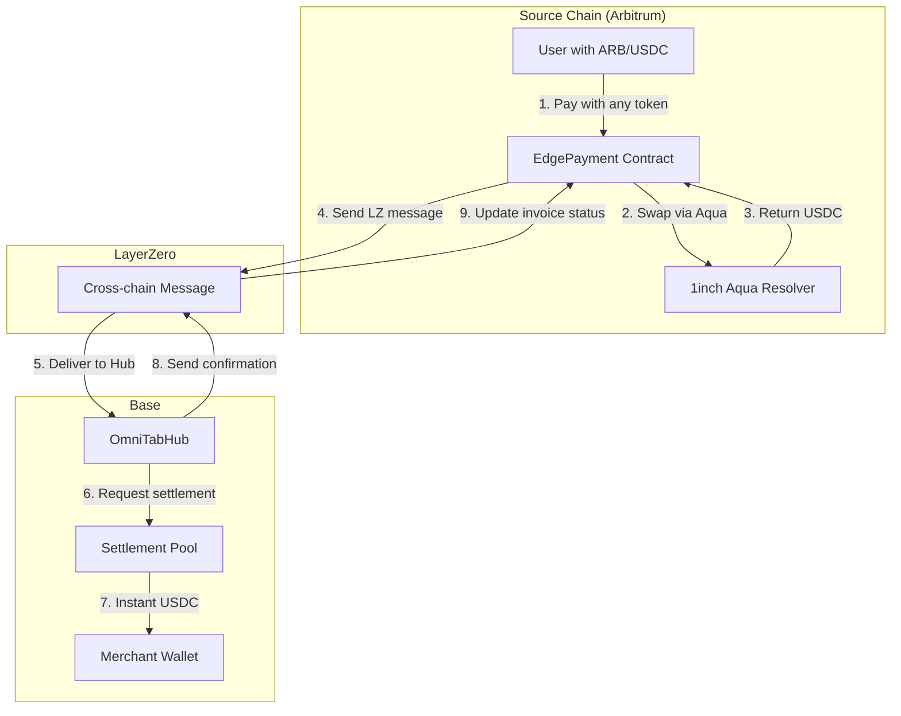
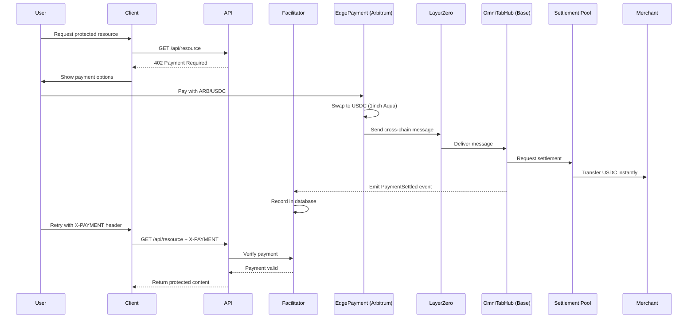
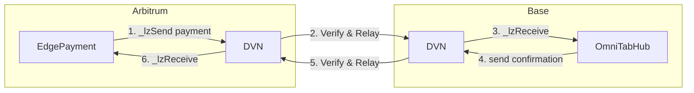
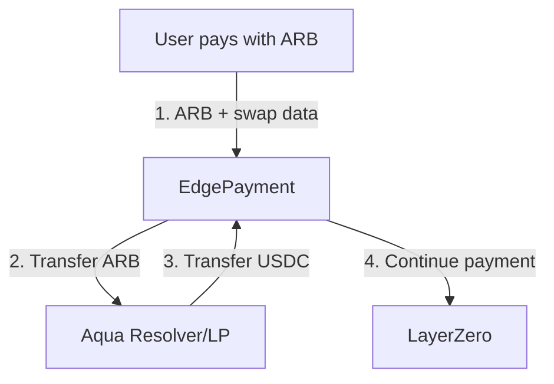
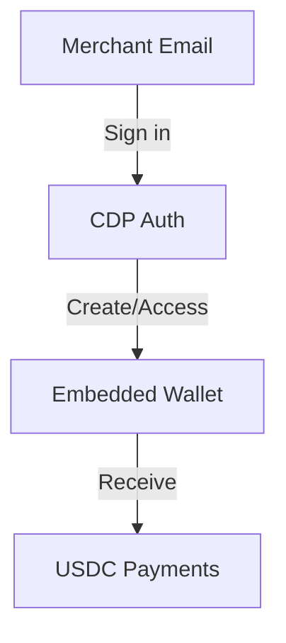

# omni402

**Omnichain x402 Payment Facilitator**

Pay from any chain, any token. Settle instantly on Base.

omni402 is a clearing layer between fragmented user liquidity and x402 USDC invoices. It enables users to pay with any token on any supported chain while merchants receive instant USDC settlement on Base.

## Architecture Overview



## Key Features

- **Any Token, Any Chain**: Users pay with whatever they have - ARB, ETH, USDC on Arbitrum
- **Instant Settlement**: Merchants receive USDC on Base within seconds, not minutes
- **Managed Wallets**: CDP-powered embedded wallets for merchants with full transaction history
- **Simple Integration**: Two lines of code to protect any API endpoint

## How It Works

### Payment Flow



## Project Structure

```
omni402/
├── apps/
│   └── web/                 # Next.js frontend
├── packages/
│   ├── contracts/           # Solidity smart contracts
│   ├── facilitator/         # Payment verification service
│   └── sdk/                 # TypeScript SDK
```

## Quick Start

### For Merchants

1. Sign up at `/merchant` with your email
2. Get your CDP-managed wallet address
3. Integrate the SDK:

```typescript
import { requirePayment } from "@omni402/sdk/next";

export const GET = requirePayment({
  amount: "100000", // 0.1 USDC (6 decimals)
  payTo: "0xYourAddress",
}, async (req) => {
  return Response.json({ content: "Premium content" });
});
```

4. Wrap your app with the provider:

```typescript
import { Omni402Provider } from "@omni402/sdk/next";

export default function Layout({ children }) {
  return (
    <Omni402Provider facilitatorUrl="https://...">
      {children}
    </Omni402Provider>
  );
}
```

## Technology Stack

### LayerZero V2

LayerZero provides the cross-chain messaging infrastructure that enables omni402 to settle payments instantly with a full round-trip confirmation.



**Integration Points:**
- `EdgePayment` extends `OApp` - sends payments AND receives settlement confirmations
- `OmniTabHub` extends `OApp` - receives payments AND sends confirmations back
- Both contracts implement bidirectional messaging for full round-trip
- Configurable DVN security for message verification

### 1inch Protocols

#### Aqua (SwapVM)

1inch Aqua enables trustless token swaps on source chains with liquidity provided by resolvers.



**How it works:**
- User provides swap execution data from 1inch API
- EdgePayment validates strategy hash
- Resolver provides USDC in exchange for user's tokens
- No AMM slippage - resolver takes the other side

#### Fusion+ (Planned)

For batch replenishment of settlement pool liquidity across chains.

### Coinbase Developer Platform (CDP)

CDP provides the merchant wallet infrastructure with:



**Features Used:**
- **Embedded Wallets**: Email-based authentication, no seed phrases
- **Transaction History**: Full payment tracking in merchant dashboard
- **Easy Withdrawals**: Standard ERC-20 transfers to any address

## Deployed Contracts

| Contract | Network | Address |
|----------|---------|---------|
| OmniTabHub | Base | `0x78f0d4741f6d4a37a5f1448577f69bC1df74a349` |
| EdgePayment | Arbitrum | `0x8DF60458b46339e52fDB7D39E623D45CD97cEbd7` |

## Components

- **[Contracts Documentation](./packages/contracts/README.md)** - Deep dive into smart contracts
- **[Facilitator Documentation](./packages/facilitator/README.md)** - Payment verification service

## Environment Variables

### Web App
```env
NEXT_PUBLIC_CDP_PROJECT_ID=your-cdp-project-id
NEXT_PUBLIC_FACILITATOR_URL=http://localhost:3001
```

### Facilitator
```env
DATABASE_URL=postgres://...
BASE_RPC_URL=https://mainnet.base.org
ARBITRUM_RPC_URL=https://arb1.arbitrum.io/rpc
HUB_ADDRESS=0x78f0d4741f6d4a37a5f1448577f69bC1df74a349
EDGE_ARBITRUM_ADDRESS=0x8DF60458b46339e52fDB7D39E623D45CD97cEbd7
PORT=3001
```

## Development

```bash
# Install dependencies
npm install

# Run web app
cd apps/web && npm run dev

# Run facilitator
cd packages/facilitator && npm run dev
```

## License

MIT

---

Built for ETHGlobal Buenos Aires 2025
