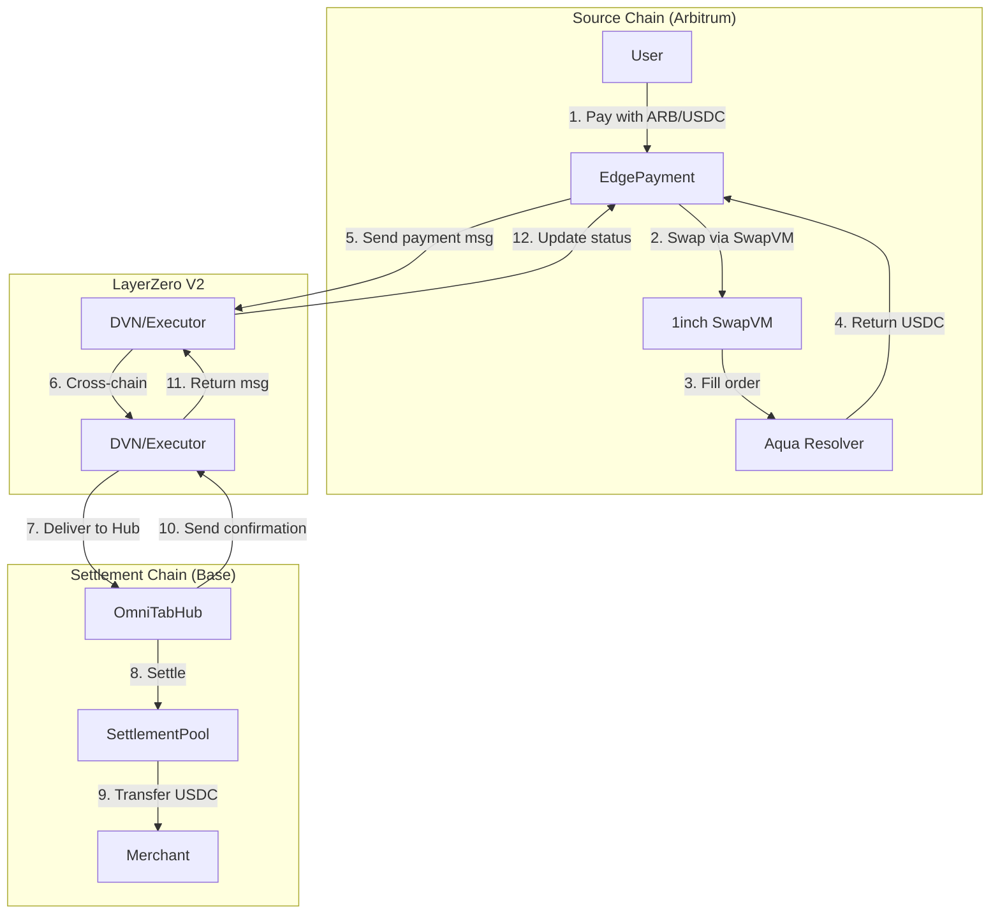
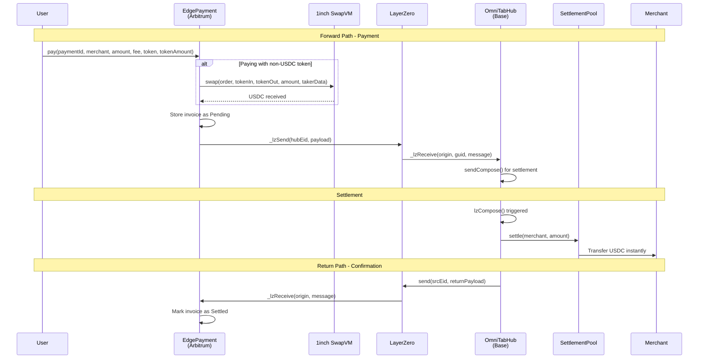
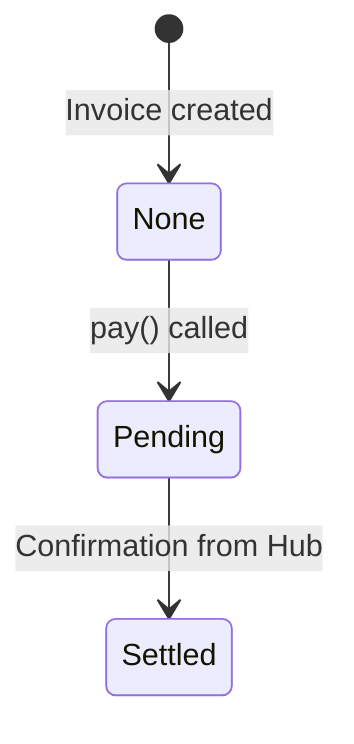
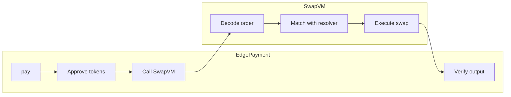
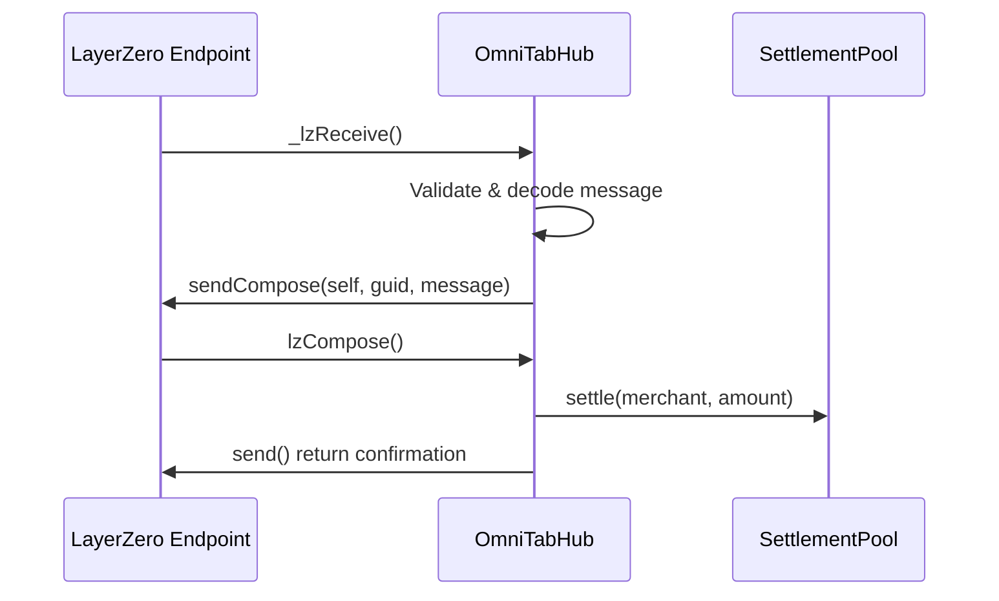
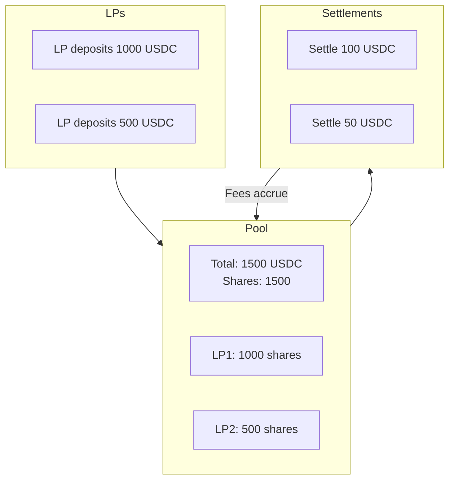
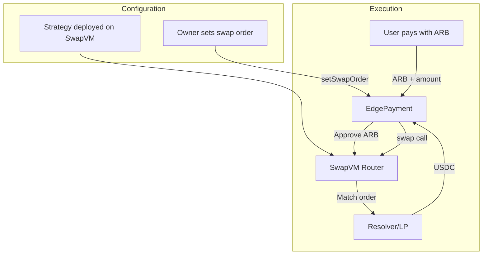

# omni402 Smart Contracts

Cross-chain payment system using LayerZero V2 for messaging and 1inch Aqua (SwapVM) for token swaps.

## Architecture Overview



## Complete Payment Flow



## Contracts Deep Dive

### EdgePayment.sol

Lives on edge chains (Arbitrum, Polygon). Accepts user payments and sends cross-chain messages to the hub.



#### Key Features

- **Multi-token support**: Pay with USDC or any supported token (e.g., ARB)
- **SwapVM integration**: Automatic token swaps via 1inch Aqua
- **Invoice tracking**: Stores payment details with status tracking
- **Vault accounting**: Tracks collected USDC for pool replenishment

#### Core Functions

```solidity
// Pay for a resource
function pay(
    bytes32 paymentId,    // Unique invoice ID
    address merchant,     // Merchant to receive funds
    uint256 amount,       // Payment amount in USDC
    uint256 fee,          // Protocol fee
    address token,        // Token user is paying with
    uint256 tokenAmount   // Amount of token (for swaps)
) external payable;

// Get LZ fee quote
function quote(
    bytes32 paymentId,
    address merchant,
    uint256 amount,
    uint256 fee
) external view returns (MessagingFee memory);
```

#### SwapVM Integration



The swap uses these taker traits:
- `IS_EXACT_IN (0x0001)`: User specifies exact input amount
- `USE_TRANSFER_FROM_AND_AQUA_PUSH (0x0040)`: Router pulls tokens, resolver pushes output

---

### OmniTabHub.sol

Lives on Base. Receives payment messages and coordinates settlements.

#### Key Features

- **Message processing**: Receives and validates cross-chain payments
- **Composable settlement**: Uses lzCompose for atomic settlement + confirmation
- **Return confirmation**: Sends settlement confirmation back to source chain
- **Trusted edge validation**: Only accepts messages from registered edge contracts

#### Core Functions

```solidity
// Receive payment message (called by LayerZero)
function _lzReceive(
    Origin calldata _origin,
    bytes32 _guid,
    bytes calldata _message,
    address _executor,
    bytes calldata _extraData
) internal override;

// Compose callback for settlement (called by LayerZero)
function lzCompose(
    address _from,
    bytes32 _guid,
    bytes calldata _message,
    address _executor,
    bytes calldata _extraData
) external payable;
```

#### Compose Flow



---

### SettlementPool.sol

Lives on Base. Provides USDC liquidity for instant merchant settlements.

#### Key Features

- **Share-based LP**: LPs receive shares proportional to deposit
- **Instant settlements**: Hub settles merchants from pool liquidity
- **Pool caps**: Owner can limit total deposits
- **Replenishment**: Receives funds back from edge vaults

#### LP Mechanics



#### Core Functions

```solidity
// LP deposits USDC
function deposit(uint256 amount) external returns (uint256 shares);

// LP withdraws with fees earned
function withdraw(uint256 shares) external returns (uint256 amount);

// Hub settles merchant (only callable by hub)
function settle(address merchant, uint256 amount) external onlyHub;

// Replenish pool from edge vault
function replenish(uint256 amount) external onlyHub;
```

---

## 1inch Aqua Integration

### SwapVM Order Structure

```solidity
struct Order {
    address maker;      // Resolver providing liquidity
    uint256 traits;     // Strategy configuration
    bytes data;         // Encoded swap parameters
}
```

### How Swaps Work



### Resolver Benefits

- **No AMM slippage**: Resolver takes the exact opposite side
- **Professional liquidity**: Resolvers are sophisticated market makers
- **Better execution**: Often better than AMM routes
- **Gas efficient**: Single hop vs multi-hop AMM routing

---

## LayerZero V2 Integration

### OApp Inheritance

```
EdgePayment → OApp → OAppSender + OAppReceiver + OAppCore
OmniTabHub → OApp → OAppSender + OAppReceiver + OAppCore
```

### Message Options

EdgePayment uses two executor options:
1. **lzReceive gas**: For initial message processing on Hub
2. **lzCompose gas**: For settlement + return message composition

```solidity
bytes memory options = OptionsBuilder.newOptions()
    .addExecutorLzReceiveOption(200000, 0)      // For _lzReceive
    .addExecutorLzComposeOption(0, 150000, 0);  // For lzCompose
```

### Peer Wiring

Both contracts must be wired as peers:

```bash
# On Base (Hub)
hub.setPeer(arbitrumEid, bytes32(edgeAddress))
hub.setTrustedEdge(arbitrumEid, true)

# On Arbitrum (Edge)
edge.setPeer(baseEid, bytes32(hubAddress))
```

---

## Deployment

### Contract Addresses

| Contract | Network | Address |
|----------|---------|---------|
| OmniTabHub | Base Mainnet | `0x78f0d4741f6d4a37a5f1448577f69bC1df74a349` |
| SettlementPool | Base Mainnet | `0x20A9f1Ec0d7096eDED353483b36b105fA6B5a428` |
| EdgePayment | Arbitrum One | `0x8DF60458b46339e52fDB7D39E623D45CD97cEbd7` |

### Deployment Scripts

```bash
# Deploy all contracts
npx hardhat run scripts/deploy.ts --network base
npx hardhat run scripts/deploy.ts --network arbitrum

# Wire LayerZero peers (both directions)
npx hardhat run scripts/wire-peers.ts --network base
npx hardhat run scripts/wire-peers.ts --network arbitrum

# Configure swap order for non-USDC payments
npx hardhat run scripts/deploy-swapvm-strategy.ts --network arbitrum

# Seed pool liquidity
npx hardhat run scripts/topup.ts --network base
```

---

## Environment Variables

```env
# Deployment
DEPLOYER_PRIVATE_KEY=

# RPCs
BASE_RPC_URL=https://mainnet.base.org
ARBITRUM_RPC_URL=https://arb1.arbitrum.io/rpc

# 1inch API (for strategy deployment)
ONEINCH_API_KEY=

# Testing
TAKER_PRIVATE_KEY_TEST=
MAKER_ADDRESS=
```

---

## Testing Payments

```bash
# Test a full payment flow
npx hardhat run scripts/test-payment.ts --network arbitrum

# Test swap via SwapVM
npx hardhat run scripts/swap-via-swapvm.ts --network arbitrum
```

---

## Security Considerations

1. **Trusted edges only**: Hub validates `trustedEdges[srcEid]` before processing
2. **Replay protection**: `processedPayments[paymentId]` prevents double processing
3. **Reentrancy guards**: All external functions use `nonReentrant`
4. **Safe transfers**: Uses OpenZeppelin's `SafeERC20`
5. **Access control**: Owner-only functions for configuration
6. **Hub authorization**: Pool only accepts calls from registered hub

---

## Gas Costs

Approximate gas costs per operation:

| Operation | Gas |
|-----------|-----|
| EdgePayment.pay (USDC) | ~150,000 |
| EdgePayment.pay (swap) | ~250,000 |
| OmniTabHub._lzReceive | ~100,000 |
| OmniTabHub.lzCompose | ~150,000 |
| SettlementPool.settle | ~80,000 |

Plus LayerZero cross-chain fees (~0.01-0.05 ETH depending on source/dest chains).

---

## Future Enhancements

- **Fusion+ integration**: Cross-chain pool rebalancing using 1inch Fusion+
- **Multiple edge chains**: Polygon, Optimism, etc.
- **Fee distribution**: LP rewards from protocol fees
- **Batch settlements**: Multiple payments in single LZ message
