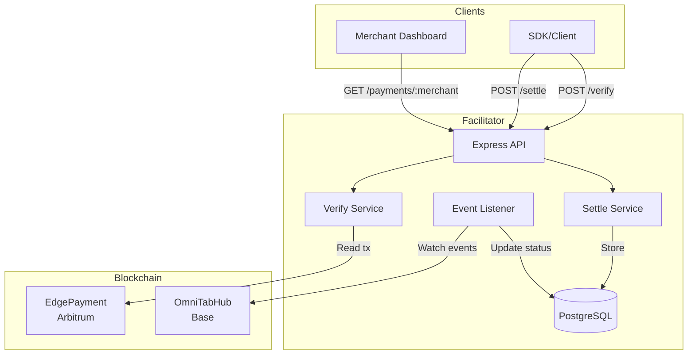
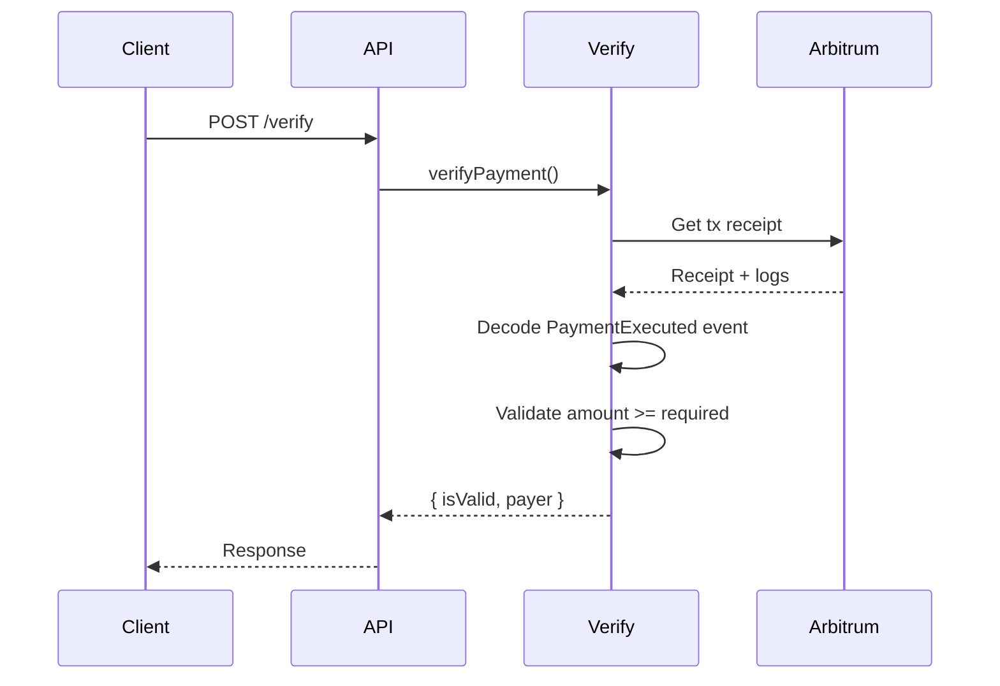
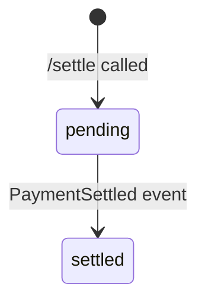

# omni402 Facilitator

Payment verification and settlement service for the omni402 protocol.

## Overview

The Facilitator is an Express.js service that:
1. Verifies payment proofs from EdgePayment transactions
2. Stores payment records in PostgreSQL
3. Listens to Hub events for settlement confirmations
4. Provides payment history for merchant dashboards

## Architecture



## API Endpoints

### `GET /health`
Health check endpoint.

### `GET /supported`
Returns supported chains and tokens.

### `POST /verify`
Verify a payment without storing it.

### `POST /settle`
Verify and store a payment.

### `GET /payments/:merchant`
Get payment history for a merchant address.

## Payment Verification Flow



## Event Listener

Listens to `PaymentSettled` events from Hub to update payment statuses:



## Database Schema

```prisma
model Payment {
  id              String   @id @default(uuid())
  invoiceId       String
  sourceChain     Int
  payerAddress    String
  merchantAddress String
  amount          Decimal
  edgeTxHash      String   @unique
  lzMessageId     String
  status          String   @default("pending")
  createdAt       DateTime @default(now())
  settledAt       DateTime?
  settlementTxHash String?
}
```

## Configuration

```env
DATABASE_URL=postgres://...
BASE_RPC_URL=https://mainnet.base.org
ARBITRUM_RPC_URL=https://arb1.arbitrum.io/rpc
HUB_ADDRESS=0x...
EDGE_ARBITRUM_ADDRESS=0x...
PORT=3001
```

## Running

```bash
npm install
npx prisma generate
npx prisma migrate dev
npm run dev
```
